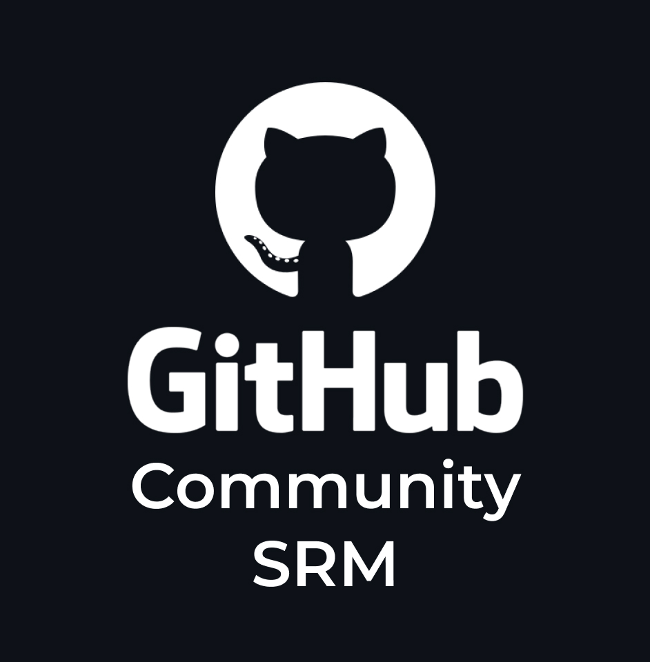

<div align="center">
  
</div>
<div align="center">
  
</div>

<br>
<p align="center">
GitHub Community SRM is the foremost student-led community spearheading the Open Source Revolution at SRMIST, Chennai.
</project>
<p align="center">
rendered with <span style="color: #8b0000;">&hearts;</span> by your friends at <a href="https://githubsrm.tech">GitHub Community SRM</a>.
</p>
<p align="center">
    
    
    
</p>

## Preview 📺

<div align="center">
  
</div>

## Installation 🔧

Install dependencies and build the server

```
$ yarn install && yarn build
```

Start the CLI

```
$ yarn dev
```

## License 📜

`GitHub Community SRM` is available under the MIT license. See the LICENSE file for more info.

## Contributing 🤝

Please read `Contributing.md` for details on our code of conduct, and the process for submitting pull requests to us.

## Forking this repo 🚨

Many people have contacted us asking if they can use this code for their own websites. The answer to that question is usually "yes", with attribution. There are some cases, such as using this code for a business or something that is greater than a personal project, that we may be less comfortable saying yes to. If in doubt, please don't hesitate to ask us.

We value keeping this site open source, but as you all know, _**plagiarism is bad**_. We spent a non-negligible amount of effort developing, designing, and trying to perfect this iteration of our website, and we are proud of it! All we ask is to not claim this effort as your own.

So, feel free to fork this repo. If you do, please just give us proper credit by linking back to our website, https://githubsrm.tech. Refer to this handy [quora post](https://www.quora.com/Is-it-bad-to-copy-other-peoples-code) if you're not sure what to do. Thanks!
